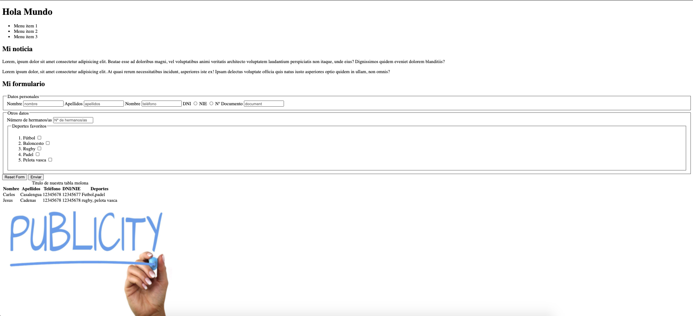
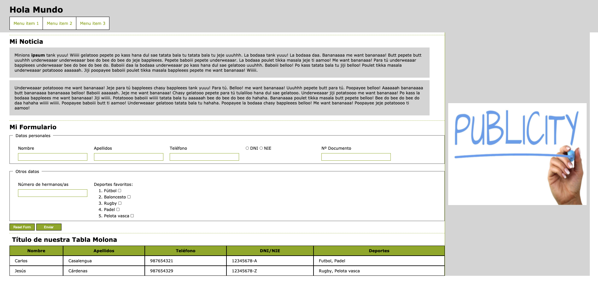

# Formación HTML-CSS-SASS

Esta formación constará de 3 prácticas en las que aprenderemos a dominar los siguientes conocimientos:
- HTML
- CSS
- SASS

Cada uno de estos apartados contarán con una rama donde podras encontrar un documento teórico en el que respaldarse para enfrentarse a la práctica y su posterior revisión donde además abordaremos las mejores prácticas de desarrollo en el día a día. Estos ejercicios son escalables de manera que siempre partiremos de la anterior solución. En cada una de las ramas existira un tag solución para poder continuar a la siguiente en caso de no haber realizado con exito la anterior práctica.

## Configuración 
1. Ejecutaremos en primer lugar `npm init` para instalar futuras dependencias que necesitaremos más adelante
2. Precisaremos de un servidor para levantar el proyecto, en este caso usaremos [http-server](https://www.npmjs.com/package/http-server),   lanzando el comando `npm i http-server`
3. Una vez hecho esto, crearemos un script en el package.json para lanzar `http-server`

A continuación, detallaremos el enunciado de los ejercicios que nos acompañaran a lo largo del curso.

## Práctica HTML

Teniendo en cuenta la siguiente imagen, crea la estructura HTML tomando como referencia los criterios semanticos que se abordan en las [diapositivas](HTML_Basico.pptx) del bloque formativo. Los recursos necesarios para la realización del ejercicio se encuentren en el mismo repositorio, considera cual deberia ser la correcta estructura de archivos, ten en cuenta que dicha práctica es escalable y el punto de partida de cada sesión dependera de la anterior.

## Práctica CSS

Teniendo en cuenta la siguiente imagen, crea la estructura HTML tomando como referencia los criterios semanticos que se abordan en las [diapositivas](curso_css_basico.pptx) del bloque formativo. Los recursos necesarios para la realización del ejercicio se encuentren en el mismo repositorio, considera cual deberia ser la correcta estructura de archivos, 

Teniendo en cuenta la siguiente imagen, estiliza la estructura HTML para obtener un retrato fiel de la misma. Los recursos necesarios para la realización del ejercicio se encuentran en el repositorio.

## Prácticas SASS

## Ejercicio 1
1. Dada la estructura base, analizar el archivo _index.html_ y migrar la nomenclatura bajo la metodología BEM, clonando estas nuevas clases en el archivo _assets/styles/style.css_
2. Una vez hecho esto comprobar el visual

## Ejercicio 2
Con las clases CSS bajo la nomenclatura BEM, es momento de crear una estructura ITCSS. Lo haremos usando nomenclatura SASS y empezaremos a jugar con la compilación.
1. Instalamos sass `npm i -g sass`
2. Creamos las carpetas con sus respectivos archivos definidos por ITCSS
3. En el package.json, creamos el script que ejecutará la compilación, basandonos en la [Command-line Interface](https://sass-lang.com/documentation/cli/dart-sass) del propio sass.
4. Comprobamos que no haya cambiado nada en el visual

## Ejercicio 3
1. Analiza tu arquitectura y crea variables SASS para hacer configurable el proyecto. Prueba a cambiar el tamaño a los textos para comprobarlo
2. Crea un mixin de fuentes para que con cada `@include`, generes una nueva. _Reto:_ Hazlo por medio de un bucle
3. Dada la siguiente lista de iconos, ubicala donde creas y genera tantas clases como nombres tenga la lista donde corresponda.
~~~
  first-page: "\e92d",
  last-page: "\e92e",
  button-success: "\e92c",
  table-options: "\e92b",
  mouse-square: "\e928",
  mouse-circle: "\e929",
  responsive-table: "\e92a",
  arrow-down: "\e916",
  arrow-up: "\e917",
  button-delete: "\e918",
  cloud-download: "\e919",
  delete: "\e91a",
  edit: "\e91b",
  email: "\e91c",
  facebook: "\e91d",
  grid-system: "\e91e",
  instagram: "\e91f",
  linkedin: "\e920",
  lock-close: "\e921",
  lock-open: "\e922",
  menu-option: "\e923",
  share: "\e924",
  twitter: "\e925",
  user-logged: "\e926",
  youtube: "\e927",
  eye-iluminated: "\e915",
  menu-mobile: "\e913",
  close: "\e914",
  arrow: "\e900",
  calendar: "\e901",
  checkbox-checked: "\e902",
  checkbox-checked-disabled: "\e903",
  checkbox-hover: "\e904",
  checkbox-indeterminate: "\e905",
  checkbox-indeterminate-disabled: "\e906",
  checkbox-unchecked: "\e907",
  checkbox-unchecked-disabled: "\e908",
  eye: "\e909",
  network: "\e90a",
  profile: "\e90b",
  radio-checked: "\e90c",
  radio-checked-disabled: "\e90d",
  radio-hover: "\e90e",
  radio-unchecked: "\e90f",
  radio-unchecked-disabled: "\e910",
  search: "\e911",
  tic: "\e912"
~~~
4. Crea una utilidad de margenes que por medio de un bucle obtengas las siguientes clases:

**Cuidado con el valor incremental de cada vuelta**
~~~
    .mt-sm-1{
        margin-top:5px
    }

    .mt-sm-2{
        margin-top:10px
    }...

    .mr-md-1{
        margin-right:5px;
    }

    .mr-md-2{
        margin-right:10px;
    }...
~~~
**_BONUS:_** Crea una grid configurable teniendo en cuenta el número,espaciado entre columnas y ancho de cada una. A continuación, haz un bucle para que te genere tantas clases como columnas tenga la grid, además de tener en cuenta los puntos de corte. PD: Si modifico el número de columnas, el número de clases generadas tendran que ser igual a esta. El resultado deberia ser el siguiente:
~~~
@media only screen and (min-width: 0) {
  .col-sm-1 {
    padding: 0 12px;
    box-sizing: border-box;
    flex: 0 0 8.3333333333%;
    min-width: 8.3333333333%;
    max-width: 8.3333333333%;
  }...
}

@media only screen and (min-width: 768px) {
  .col-md-1 {
    padding: 0 12px;
    box-sizing: border-box;
    flex: 0 0 8.3333333333%;
    min-width: 8.3333333333%;
    max-width: 8.3333333333%;
  }...
}

@media only screen and (min-width: 1200px) {
  .col-lg-1 {
    padding: 0 12px;
    box-sizing: border-box;
    flex: 0 0 8.3333333333%;
    min-width: 8.3333333333%;
    max-width: 8.3333333333%;
  }...
}
~~~

### Ejercicio 4
1. Instala la depedencia `npm i sass-lint`
2. Crea el archivo de configuración para poder hacer el lintado a tu sass, y añade alguna [regla](https://github.com/sasstools/sass-lint/tree/master/docs/rules) para comprobarlo
3. Crea un nuevo script para comprobar el lintado de tu archivos, debes excluir todos los archivos de _node_modules_

### Ejercicio 5
1. Cambia las variables sass por [custom properties](https://drafts.csswg.org/css-variables/#defining-variables)
2. Comprueba que al cambiar el valor de estas se hacen los cambios pertinentes