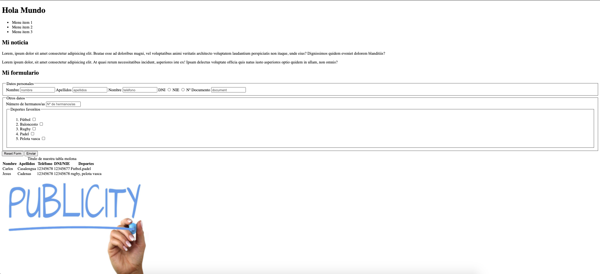

# Formación HTML-CSS-SASS

Esta formación constará de 3 prácticas en las que aprenderemos a dominar los siguientes conocimientos:
- HTML
- CSS
- SASS

Cada uno de estos apartados contarán con una rama donde podras encontrar un documento teórico en el que respaldarse para enfrentarse a la práctica y su posterior revisión donde además abordaremos las mejores prácticas de desarrollo en el día a día. Estos ejercicios son escalables de manera que siempre partiremos de la anterior solución. En cada una de las ramas existira un tag solución para poder continuar a la siguiente en caso de no haber realizado con exito la anterior práctica.

## Configuración 
1. Ejecutaremos en primer lugar `npm init` para instalar futuras dependencias que necesitaremos más adelante
2. Precisaremos de un servidor para levantar el proyecto, en este caso usaremos [http-server](https://www.npmjs.com/package/http-server),   lanzando el comando `npm i http-server`
3. Una vez hecho esto, crearemos un script en el package.json para lanzar `http-server`

A continuación, detallaremos el enunciado de los ejercicios que nos acompañaran a lo largo del curso.

## Práctica HTML

La raíz del ejercicio parte de la rama ```html-block```, de modo que deberéis cambiaros a dicha rama y traeros los cambios. Teniendo en cuenta la siguiente imagen, crea la estructura HTML tomando como referencia los criterios semanticos que se abordan en las [diapositivas](HTML_Basico.pptx) del bloque formativo. Los recursos necesarios para la realización del ejercicio se encuentren en el mismo repositorio, considera cual deberia ser la correcta estructura de archivos, ten en cuenta que dicha práctica es escalable y el punto de partida de cada sesión dependera de la anterior.


